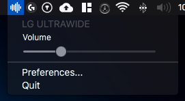
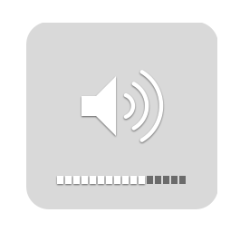

# ScreenVolume2

A simplified version of the0neyouseeks MonitorControl, which is restricted on changing the volume directly of external screens from a menulet or with keyboard native keys. By removing unnecessary polling I achieved a nearly 0 percent CPU usage!

If you need to run the application on startup, please use the manual way (Settings --> Users and Groups)



*Bonus: Using keyboard keys display the native osd :*




## Download

Precompiled binary, ready to use:
[Releases](https://github.com/mavodev-de/ScreenVolume2/releases)

## How to help

Open [issues](./issues) if you have a question, an enhancement to suggest or a bug you've found. If you want you can fork the code yourself and submit a pull request to improve the app.

Please note: I primarily did all modifications for my own use. So don't expect too much extra work from me ;-) 

## How to build

```diff
- These instructions are from the repo by the0neyouseek 
- and might not work on my modified version of the project
```

### Required

- XCode
- [Cocoapods](https://cocoapods.org/)
- [SwiftLint](https://github.com/realm/SwiftLint)

Download the [zip](https://github.com/mavodev-de/ScreenVolume2/archive/master.zip) directly or clone the project somewhere with git

```sh
$ git clone https://github.com/mavodev-de/ScreenVolume2.git
```

Then download the dependencies with Cocoapods

```sh
$ pod install
```

You're all set ! Now open the `MonitorControl.xcworkspace` with Xcode

### Third party dependencies

- [MediaKeyTap](https://github.com/the0neyouseek/MediaKeyTap)

## Support
- macOS Sierra (`10.12`) and up.
- Works with monitors comptaible with [@kfix/ddcctl](https://github.com/kfix/ddcctl)

## Thanks
- [@bluejamesbond](https://github.com/bluejamesbond/) (Original developer)
- [@Tyilo](https://github.com/Tyilo/) (Fork)
- [@Bensge](https://github.com/Bensge/) - (Used some code from his project [NativeDisplayBrightness](https://github.com/Bensge/NativeDisplayBrightness))
- [@nhurden](https://github.com/nhurden/) (For the original MediaKeyTap)
- [@the0neyouseek](https://github.com/the0neyouseek/) (For the ControlApplet with Key Support)
